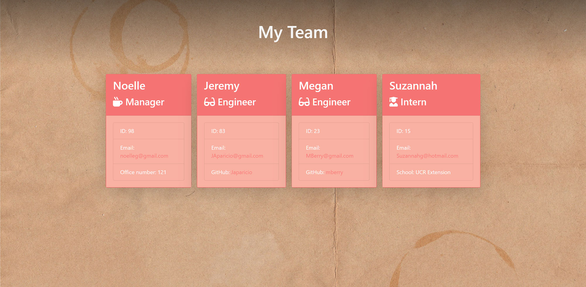

# Compamy Employee Site <!-- omit in toc -->

--- 
### Table of Contents

- [!Screenshot](#)
  - [Table of Contents](#table-of-contents)
- [Description](#description)
- [Installation](#installation)
- [How to use it](#how-to-use-it)
  - [Credits](#credits)
  - [Tests](#tests)
  - [License](#license)
  - [Questions](#questions)

## Description
A simple node server CLI for creating and displaying an employee page.

___Technologies Used___
- Node.js
- npm Inquirer
- npm Jest

___Motivation___
To simplify html page creation.

## Installation
1) Download the zip and unzip it.
2) Navigate to the Develop folder and open a terminal. 
3)  Run "npm i" to install dependencies. 

## How to use it
1)   Run "npm run start" to envoke the program.
2)   Follow the command line prompts to enter each employee.
3)   When you are done adding employees, select "no" when prompted to add another.
4) Navigate to the newly created "output" folder.
5)  Open the "team.html" file inside in your favorite web browser.

### Credits
Developers: C.T. Bell

### Tests
Open a terminal in the Develop folder and run "npm run test"

### License
#####MIT
[Link to MIT licence](https://opensource.org/licenses/MIT)

### Questions
If you have a question about this software, contact the developer at:
charlestbell@gmail.com

